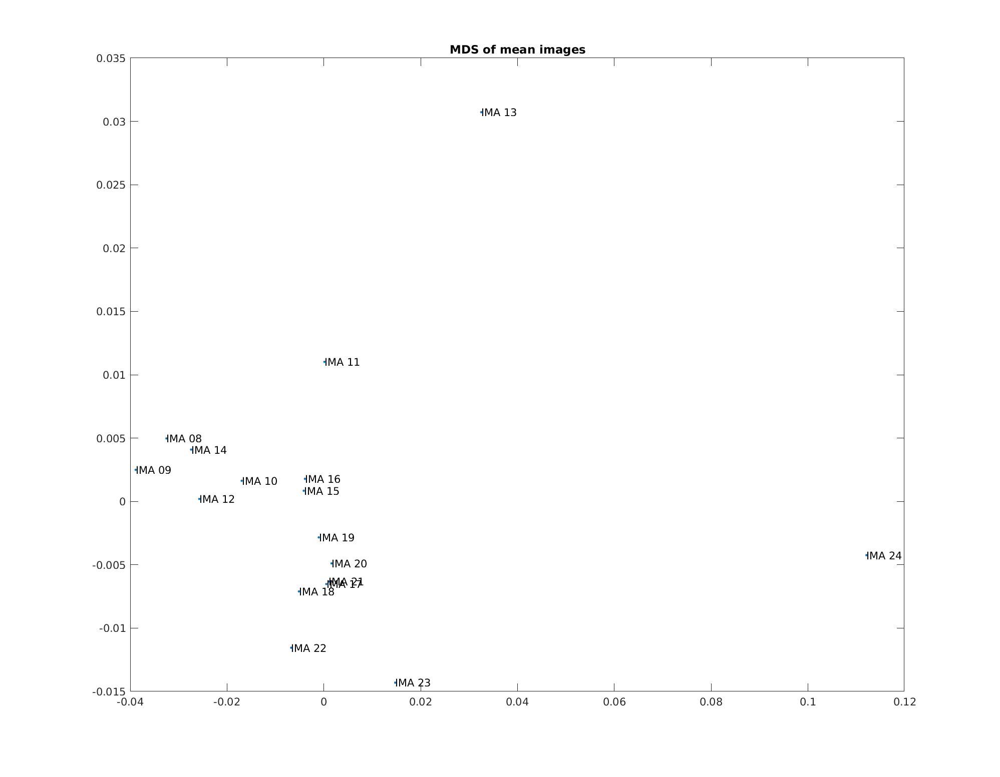
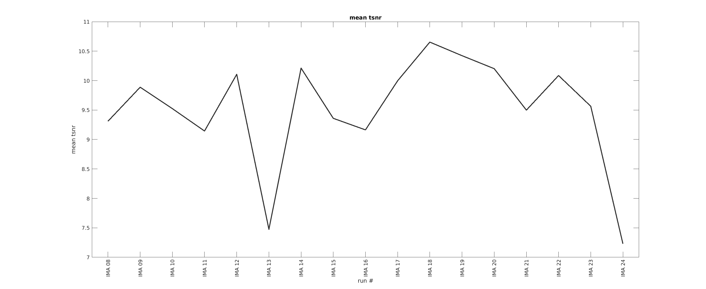
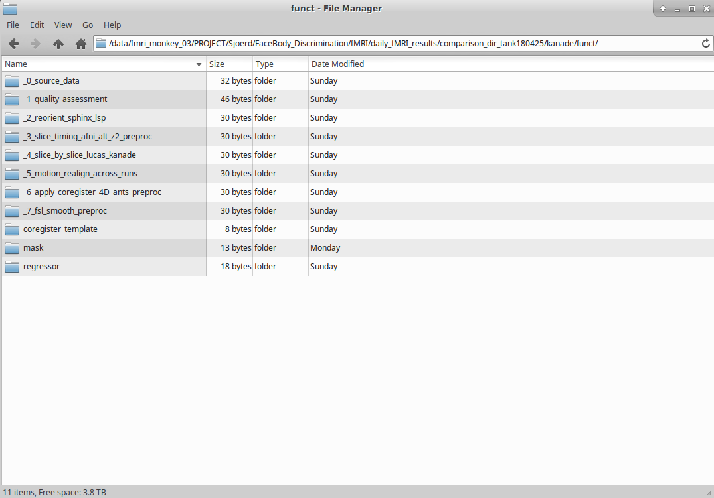
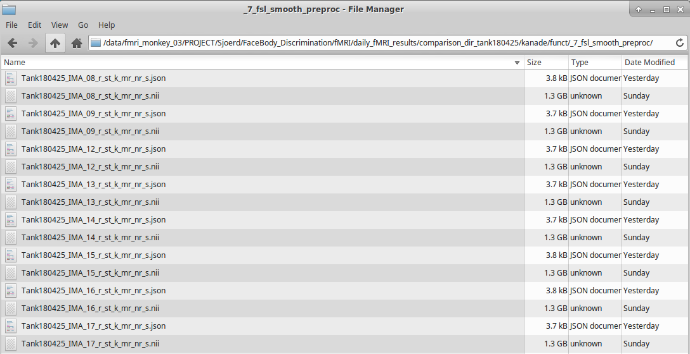

#mipipe: monkey imaging pipeline
**advantages**
**1-** imposes directory structure
**2-** saves additional information in .json
**3-** parallelizes preprocessing
**4-** spm scripts can read .json files and build 1st level analysis

##Initial changes before you start 
####change your .dcm2nii.ini to format dicom conversion

	gedit ~/.dcm2nii.ini &

make sure bids .json sidecar is outout and filename includes:
monkeyNameDate_IMA_05.nii

	isGZ=0
	isBIDS=1
	filename=%n_IMA_%2s
	
####make sure fsl commands output nifi

	gedit ~/.bashrc &
	
add these lines to your .bashrc

	#fsl data ouput
	FSLOUTPUTTYPE=NIFTI
	export FSLOUTPUTTYPE
	
####add ANTS to path

	gedit ~/.bashrc &
	
add these lines to your .bashrc

	export ANTSPATH=/mnt/.autofs/storage/gbw-s-neu01_fmri-monkey-03/PROJECT/codeshare/toolbox/ants/bin
	export PATH=${ANTSPATH}:$PATH
	
## example pre-processing
### set up main paths

set up the paths
add the path to your mipipe dir

	preproc_dir = '/data/fmri_monkey_03/PROJECT/Sjoerd/FaceBody_Discrimination/fMRI/daily_fMRI_results/mipipe/';
	addpath(preproc_dir);
	params = set_preproc_paths(preproc_dir);
	
path to base directory where pre-processing ouput goes

	params.base_dir = '/data/fmri_monkey_03/PROJECT/Sjoerd/FaceBody_Discrimination/fMRI/daily_fMRI_results/tank180425_test/';

	
path to dicoms

	params.dicom_dir = '/data/fmri_archive_01/RAW/Tank/Tank180425_DICOM/MONKEY_FUNCTIONAL_20180425_185355_274000/';
	
path to template image	

	params.template = '/data/fmri_monkey_03/PROJECT/Sjoerd/FaceBody_Discrimination/fMRI/template/tank/tank_anat.nii';
	
###specify the parameters for analysis

specify the parameters for analysis

	params.tr_no = 450; %# of trs per run
	params.image_no = 1; %image number to use for masks
	params.smooth.fwhm = 1.5; %fwhm for smoothing

specify whether to check images

	params.check_mask = 1;
	params.check_coregister = 1;

convert dicom to nifti and remove incomplete runs

	input = convert_dcm2niix_afni(params.dicom_dir, params.base_dir, params.shell_script_path);
	input = cleanup_file_list_using_tr_no(params.base_dir, input, params.tr_no);

mask and perform quality assessment

	functional_mask = preproc_mask_non_workflow(input, params);
	params.image_no = preproc_quality_assessment(input, functional_mask, params);

###mds of correlation of mean images	

###tsnr across runs
 

### interpretating quality assessment report

**Outlier Detection [outlier]:** The mean count of outliers found in each volume using the 3dToutcount command from AFNI. Lower values are better.

**Median Distance Index [quality]:** The mean distance (1 – spearman’s rho) between each time point’s volume and the median volume using AFNI’s 3dTqual command. Lower values are better.

**temporal SNR [tSNR]:** Mean intensty over time divided by standard deviation over time within brain mask.  Higher values are better.

**MDS of correlation of mean images:** closer points are more similiar images.  Farther points are less similiar.  Often indicates ghosting.

### remove bad images after quality assessment 

	runs2remove = [13 24];
	[input, params] = remove_outlier_runs(runs2remove, input, params);

define preprocessing steps

	step_no_function_pair = {2, 'reorient_sphinx_lsp'; ...
    3, 'slice_timing_afni_alt_z2_preproc'; ...   
    NaN, 'preproc_mean_mask_meanmasked_dilate_smooth'; ...
    4, 'slice_by_slice_within_run'; ...
    NaN, 'make_mean_target'; ...
    5, 'motion_realign_across_runs'; ...
    NaN, 'preproc_mask_mean_target'; ...
    NaN, 'coregister_ants_preproc'; ...
    6, 'apply_coregister_4D_ants_preproc'; ...
    7,'fsl_smooth_preproc'};

run all processing steps

	tic
    workflow = loop_workflow_steps(step_no_function_pair,input,params);
	toc
	
## understanding mipipe	

loops through each step 
ouput of step used as input of the next step

	for i_step_no = 1:size(step_no_function_pair, 1)
    
    	%get current function and step number
    	current_function = step_no_function_pair{i_step_no, 2};
    	current_step_no = step_no_function_pair{i_step_no, 1};
    
   		%run current step
    	[output, params] = run_workflow_step(input, get_preproc_functions(current_function), current_step_no, params);
    
    	%assign output of current step to input of next step
    	input = output;

	end

if function performed on each image
parfor loop through all images and run current step

	parfor i = 1:numel(input.file_list)
		input_file = #name of input image
		ouput_file = #name of ouput image
	
	 	if preproc_function.is_regressor_created
            regressor_file_name = preproc_function.function_call(input_file, ouput_file, params);
            add_workflow_step_to_json_w_regressor(input_file, ouput_file, preproc_function, step_no, regressor_file_name);
     	else
            preproc_function.function_call(input_file, ouput_file, params);
            add_workflow_step_to_json(input_file, ouput_file, preproc_function, step_no);
     	end
        
    end
	
if function **not** performed on each run
	
	params = preproc_function.function_call(input, params);
	
## writing functions for mipipe	

function where
**1:** regressor created and image 
**2:** loops through each image

	function regressor_name = example_function(input_file, output_file, params)
	
		motion_regressor_name = motion_correction_function(input_file, output_file, params.mask);
		regressor_name = {'motion_regressor',motion_regressor_name};
		
	end

function where
**1:** **no** regressor created and image 
**2:** loops through each image

	function example_function(input_file, output_file, params)
	
		smooth_function(input_file, output_file);
		
	end
	
function where
**1:** **no** regressor created and image 
**2:** **no** loops through each image

	function params = example_function(input, params)
	
		 params.mean_image_masked = mask_function(params.mask,params.mean_image);
		
	end	
	
## adding function to get_preproc_functions	

	    case 'slice_timing_afni_alt_z2_preproc'
        preproc_function.function_call = @slice_timing_afni_alt_z2_preproc;
        preproc_function.function_name = 'slice_timing_afni_alt_z2_preproc';
        preproc_function.function_description = 'slice timing correction using afni with timing set to alt+z2';
        preproc_function.prefix = 'st';
        preproc_function.is_directory_created = 1;
        preproc_function.is_regressor_created = 0;
        preproc_function.is_each_image_processed = 1;
	
## understanding directory structure
each step has a numbered folder
also regressors, masks and coregistration steps have a sepearate folder
 

each image file is followed by a suffix explaining the steps performed

Tank180425_IMA_08_r_st_u_mr_nr_s.nii 
realign (r) -> slice timing (st) -> slice-by-slice (u) -> aligned across runs (mr) -> ANTS non-rigid registration (nr) -> smoothed (s)

 	

	
## understanding json files 
each image is accompanied by json file with the same name
(below) abbreviated example of .json file
	
	{"Modality":"MR",
	"MagneticFieldStrength":3,
	"Manufacturer":"Siemens",
	"ManufacturersModelName":"Prisma_fit",
	"InstitutionName":"KUL",
	"InstitutionalDepartmentName":"Department",
	"InstitutionAddress":"Herestraat_49_Leuven_Brussels_BE_3000",
	"ProcedureStepDescription":"Monkey_Functional",
	"SoftwareVersions":"syngo_MR_E11",
	"MRAcquisitionType":"2D",
	"SeriesDescription":"ep2d_p3_1.25x1.25x1.2mm",
	"ProtocolName":"ep2d_p3_1.25x1.25x1.2mm",
	"ScanningSequence":"EP",
	"SeriesNumber":23,
	"AcquisitionTime":"23:23:39.415000",
	"SliceThickness":1.2,
	"SpacingBetweenSlices":1.2,
	"EchoTime":0.013,
	"RepetitionTime":2,
	"FlipAngle":84,
	"PartialFourier":0.75,
	"BaseResolution":84,
	"ShimSetting":[-686,4128,-1714,698,-436,-4451,1936,-69],
	"TxRefAmp":55.6199,
	"ReceiveCoilName":"8ChConnectorBox",
	"ReceiveCoilActiveElements":"RX1-8",
	"PercentPhaseFOV":100,
	"BandwidthPerPixelPhaseEncode":48.924,
	"PixelBandwidth":1655,
	"PhaseEncodingDirection":"j",
	"SliceTiming":	[0.9875,0,1.0275,0.0375,1.0675,0.0775,1.1075,0.1175,1.1475,
	0.1575,1.1875,0.1975,1.225,0.2375,1.265,0.275,1.305,0.315,1.345,0.355,1.385,0.395,1.425,0.435,1.4625,0.475,1.5025,0.5125,1.5425,0.5525,1.5825,
	0.5925,1.6225,0.6325,1.6625,0.6725,1.7,0.7125,1.74,0.75,1.78,0.79,1.82,0.83,1.86,0.87,1.9,0.91,1.9375,0.95],
	"InPlanePhaseEncodingDirectionDICOM":"COL",
	"ConversionSoftware":"dcm2niix",
	"ConversionSoftwareVersion":"v1.0.20171215 (OpenJPEG build) GCC5.3.1",
	"preproc_step_2_name":"reorient_sphinx_lsp",
	"preproc_step_2_description":"reorients image acquired in sphinx position and HeadFirstProne orientation and labelled as LSP correctly",
	"preproc_step_2_prefix":"r",
	"preproc_step_3_name":"slice_timing_afni_alt_z2_preproc",
	"preproc_step_3_description":"slice timing correction using afni with timing set to alt+z2",
	"preproc_step_3_prefix":"st",
	"preproc_step_4_name":"slice_by_slice_lucas_kanade",
	"preproc_step_4_description":"runs slice by slice lucas kanade motion realignment",
	"preproc_step_4_prefix":"k",
	"motion_regressor":"/data/fmri_monkey_03/PROJECT/Sjoerd/FaceBody_Discrimination/fMRI/daily_fMRI_results/tank180425/kanade//funct/regressor/slice_by_slice_lucas_kanade/Tank180425_IMA_23_r_st_k_Nbasis12_masknorm0.10_stats.txt",
	"preproc_step_5_name":"motion_realign_across_runs",
	"preproc_step_5_description":"motion realignment across runs",
	"preproc_step_5_prefix":"mr",
	"preproc_step_6_name":"apply_coregister_4D_ants_preproc",
	"preproc_step_6_description":"applies ants",
	"preproc_step_6_prefix":"nr",
	"preproc_step_7_name":"fsl_smooth_preproc",
	"preproc_step_7_description":"smooths each images with a fwhm kernel",
	"preproc_step_7_prefix":"s",
	"spm_order_file":"/data/fmri_monkey_03/PROJECT/Sjoerd/FaceBody_Discrimination/fMRI/daily_spm_matFiles/Tank20180425/Tank_20180425_2327_Q_spm.mat",
	"pca_regressor":"/data/fmri_monkey_03/PROJECT/Sjoerd/FaceBody_Discrimination/fMRI/daily_fMRI_results/tank180425/kanade/funct/regressor/glm_denoise/Tank180425_IMA_23_r_st_k_mr_nr_s_pca_glmDenoise.txt",
	"pca_regressor_no":7}